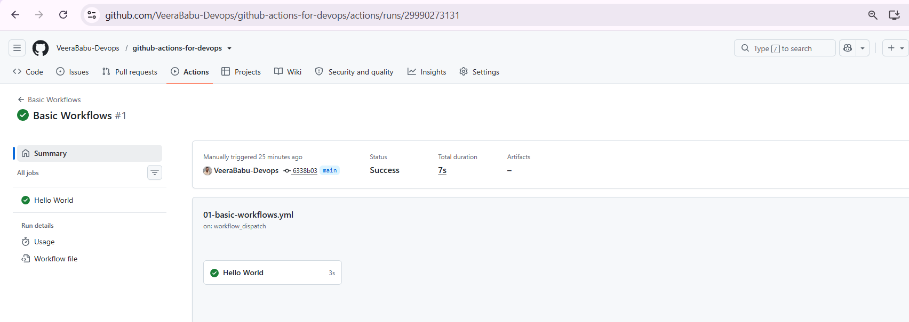
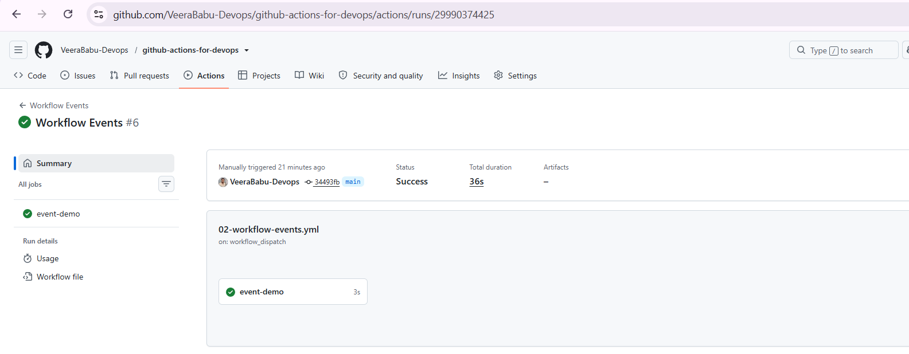
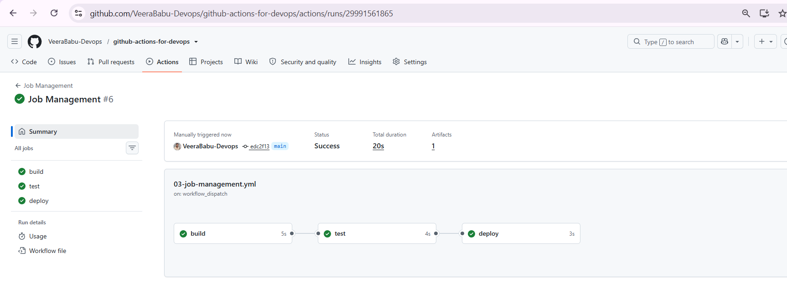
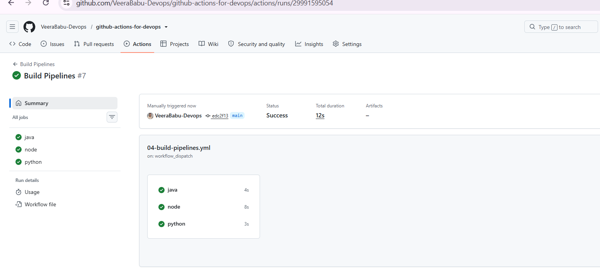

<div align="center">

# 🚀 GitHub Actions for DevOps

### A Complete Beginner to Advanced Guide to GitHub Actions

<p align="center">

Learn GitHub Actions from scratch with real-world CI/CD pipelines, AWS deployment examples, interview questions, and production-ready workflow examples.

</p>


</div>

---

# 📖 About this Repository

This repository is designed to help beginners and DevOps engineers understand **GitHub Actions** from the ground up.

Instead of only explaining the syntax, this repository focuses on **how GitHub Actions are used in real-world DevOps projects**.

Whether you're preparing for interviews, building CI/CD pipelines, or deploying applications to AWS, this guide provides practical examples and best practices.

---

# 🎯 Learning Objectives

By the end of this repository, you will be able to:

- Understand GitHub Actions Architecture
- Create GitHub Workflows
- Build CI Pipelines
- Build CD Pipelines
- Configure Runners
- Work with Jobs & Steps
- Use GitHub Marketplace Actions
- Store Secrets Securely
- Use Repository Variables
- Deploy Applications Automatically
- Deploy Static Websites to Amazon S3
- Build Java Applications
- Build NodeJS Applications
- Build Docker Images
- Understand GitHub Actions Best Practices
- Prepare for DevOps Interviews

---

# 📚 Repository Contents

| Chapter | Topic |
|----------|-------|
| 01 | GitHub Introduction |
| 02 | Introduction to GitHub Actions |
| 03 | GitHub Actions Architecture |
| 04 | Workflow |
| 05 | Deploy Static Website to Amazon S3 |
| 06 | Troubleshooting |


---
# 📸 Workflow Execution Results

The following screenshots show successful execution of the workflow examples.

| Workflow | Status |
|----------|--------|
| Basic Workflows | ✅ |
| Workflow Events | ✅ |
| Job Management | ✅ |
| Build Pipelines | ✅ |
| AWS Deployment | ✅ |

## Basic Workflow



## Workflow Events



## Job Management



## Build Pipelines



## AWS Deployment


---

# 🏗 Repository Structure

```
github-actions-for-devops
│
├── README.md
│
├── .github
|      ├──workflows      
|
├── docs
│   ├── 01-GitHub-Introduction.md
│   ├── 02-GitHub-Actions.md
│   ├── 03-Architecture.md
│   ├── 04-Workflow.md
│   ├── 05-Troubleshooting.md
│   └── 06-Interview-Questions.md
│
├── examples
│
├── images
```

---

# 🚀 What You Will Learn

## GitHub Fundamentals

- GitHub
- Repository
- Branch
- Commit
- Pull Request
- Merge

---

## GitHub Actions

- Workflow
- Events
- Runner
- Job
- Step
- Action

---

## CI/CD

- Continuous Integration
- Continuous Delivery
- Continuous Deployment

---

## AWS Deployment

- Configure AWS Credentials
- Amazon S3 Deployment
- IAM Secrets
- Secure Deployments

---

## Production Workflows

- Java CI
- NodeJS CI
- Docker Workflow
- Multi Job Workflow
- Job Dependencies
- Manual Workflow
- Scheduled Workflow

---

# 📂 Example Workflows

The **examples** folder contains production-ready workflow files.

Examples include:

- Hello World
- Checkout Repository
- Variables
- Secrets
- Multiple Jobs
- Job Dependencies
- Java Build
- NodeJS Build
- Docker Build
- Amazon S3 Deployment

---

# 💼 Real-World Use Cases

GitHub Actions can be used to automate:

- Application Build
- Unit Testing
- Code Quality Analysis
- Security Scanning
- Docker Image Creation
- Docker Hub Push
- AWS Deployment
- Kubernetes Deployment
- Terraform Automation
- Release Automation
- Notifications

---

# 🎯 Interview Preparation

This repository includes:

- Frequently Asked Interview Questions
- Scenario-Based Questions
- Practical Examples
- Architecture Explanations
- Best Practices

Perfect for:

- DevOps Engineer
- Cloud Engineer
- AWS DevOps Engineer
- Site Reliability Engineer (SRE)
- Platform Engineer

---

# 🤝 Contributing

Contributions are welcome!

If you find an issue or would like to improve the documentation, feel free to create a Pull Request.

---

# ⭐ Support

If you find this repository helpful:

- ⭐ Star the repository
- 🍴 Fork the repository
- 📢 Share it with others

---

# 📜 License

This project is licensed under the MIT License.

---

<div align="center">

### Happy Learning 🚀

Made with ❤️ by **Veera Babu** for the DevOps Community.

</div>
