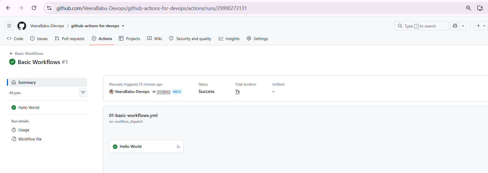
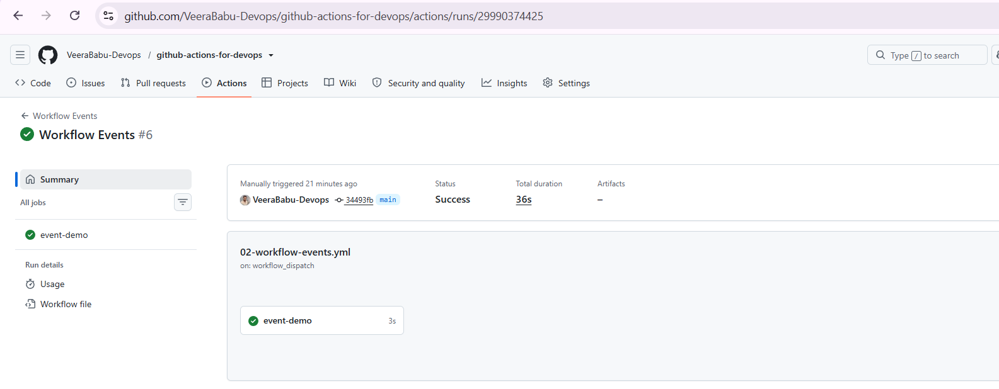
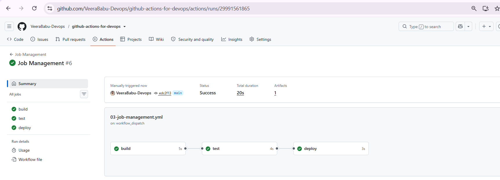
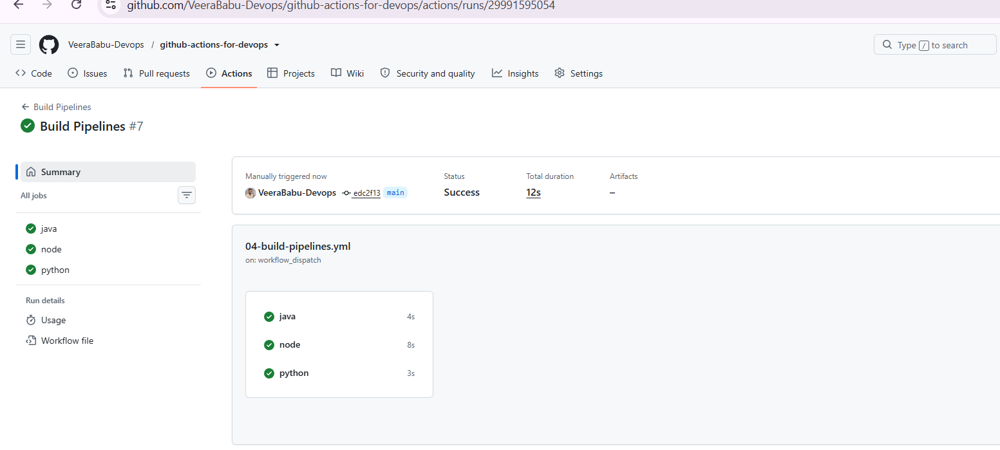

<div align="center">

# 🚀 GitHub Actions for DevOps

### Learn GitHub Actions from Beginner to Advanced with Real CI/CD Pipelines

<p align="center">

A practical GitHub Actions repository featuring production-inspired workflows, AWS deployment automation, architecture diagrams, interview preparation, and hands-on examples.

</p>

<p align="center">


</p>

</div>

---

## 📌 Project Overview

This repository is a structured learning guide for **GitHub Actions**, covering everything from workflow fundamentals to production-style CI/CD pipelines and AWS deployment.

It is designed for:

- 👨‍💻 DevOps Engineers
- ☁️ Cloud Engineers
- 🎓 Students
- 💼 Interview Preparation
- 🚀 Anyone learning GitHub Actions

Unlike most tutorial repositories, this project focuses on **real-world workflow design** rather than isolated YAML examples.

---

---

# 🛣 Learning Roadmap

```text
GitHub
    │
    ▼
GitHub Actions
    │
    ▼
Workflow
    │
    ▼
Events & Triggers
    │
    ▼
Runner
    │
    ▼
Jobs
    │
    ▼
Steps
    │
    ▼
Marketplace Actions
    │
    ▼
Variables & Secrets
    │
    ▼
Artifacts
    │
    ▼
AWS S3 Deployment
```
---

# 🛠 Skills Covered

- GitHub Actions
- YAML
- GitHub Hosted Runner
- Workflow Automation
- Event Triggers
- Job Dependencies
- GitHub Marketplace Actions
- Environment Variables
- Repository Variables
- GitHub Secrets
- Artifacts
- Node.js Build Pipeline
- Amazon S3 Deployment
- CloudFront Cache Invalidation
- CI/CD Best Practices
  
---

| Workflow | Description           | Concepts Covered                           |
| -------- | --------------------- | ------------------------------------------ |
| 01       | GitHub Actions Basics | Workflow, Job, Step, Runner                |
| 02       | Events & Triggers     | Push, Pull Request, Manual, Schedule       |
| 03       | Job Management        | Multiple Jobs, `needs`, Variables, Secrets |
| 04       | Build Pipeline        | Node.js, Build, Artifacts                  |
| 05       | AWS S3 Deployment     | AWS Credentials, S3, CloudFront            |

---

# 🌟 Project Highlights

- ✅ Designed 5 production-inspired GitHub Actions workflows
- ✅ Implemented CI/CD pipeline concepts
- ✅ Demonstrated multi-job workflow orchestration
- ✅ Used GitHub Secrets and Repository Variables
- ✅ Built a Node.js CI pipeline with artifacts
- ✅ Automated AWS S3 deployment workflow
- ✅ Created interview-focused documentation
- ✅ Included workflow execution screenshots

---

# 📸 Workflow Execution Results

The following screenshots show successful execution of the workflow examples.

| Workflow | Status |
|----------|--------|
| Basic Workflows | ✅ Success |
| Workflow Events | ✅ Success |
| Job Management | ✅ Success |
| Build Pipelines | ✅ Success |
| AWS Deployment | ✅ success |

## Workflow 01 — GitHub Actions Basics



## Workflow Events



## Job Management



## Build Pipelines



## AWS Deployment


---

# 🏗 Repository Structure

```
github-actions-for-devops
│
├── README.md
│
├── .github
|      ├──workflows      
|
├── docs
│   ├── 01-GitHub-Introduction.md
│   ├── 02-GitHub-Actions.md
│   ├── 03-Architecture.md
│   ├── 04-Workflow.md
│   ├── 05-Troubleshooting.md
│   └── 06-Interview-Questions.md
│
├── examples
│
├── images
```

---

# 🚀 What You Will Learn

## GitHub Fundamentals

- GitHub
- Repository
- Branch
- Commit
- Pull Request
- Merge

---

## GitHub Actions

- Workflow
- Events
- Runner
- Job
- Step
- Action

---

## CI/CD

- Continuous Integration
- Continuous Delivery
- Continuous Deployment

---

## AWS Deployment

- Configure AWS Credentials
- Amazon S3 Deployment
- IAM Secrets
- Secure Deployments

---

## Production Workflows

- Java CI
- NodeJS CI
- Docker Workflow
- Multi Job Workflow
- Job Dependencies
- Manual Workflow
- Scheduled Workflow

---

# 📂 Example Workflows

The **examples** folder contains production-ready workflow files.

Examples include:

- Hello World
- Checkout Repository
- Variables
- Secrets
- Multiple Jobs
- Job Dependencies
- Java Build
- NodeJS Build
- Docker Build
- Amazon S3 Deployment

---

# 💼 Real-World Use Cases

GitHub Actions can be used to automate:

- Application Build
- Unit Testing
- Code Quality Analysis
- Security Scanning
- Docker Image Creation
- Docker Hub Push
- AWS Deployment
- Kubernetes Deployment
- Terraform Automation
- Release Automation
- Notifications

---

# 🎯 Interview Preparation

This repository includes:

- Frequently Asked Interview Questions
- Scenario-Based Questions
- Practical Examples
- Architecture Explanations
- Best Practices

Perfect for:

- DevOps Engineer
- Cloud Engineer
- AWS DevOps Engineer
- Site Reliability Engineer (SRE)
- Platform Engineer

---

# 🤝 Contributing

Contributions are welcome!

If you find an issue or would like to improve the documentation, feel free to create a Pull Request.

---

# ⭐ Support

If you find this repository helpful:

- ⭐ Star the repository
- 🍴 Fork the repository
- 📢 Share it with others

---

# 📜 License

This project is licensed under the MIT License.

---

<div align="center">

### Happy Learning 🚀

Made with ❤️ by **Veera Babu** for the DevOps Community.

</div>
