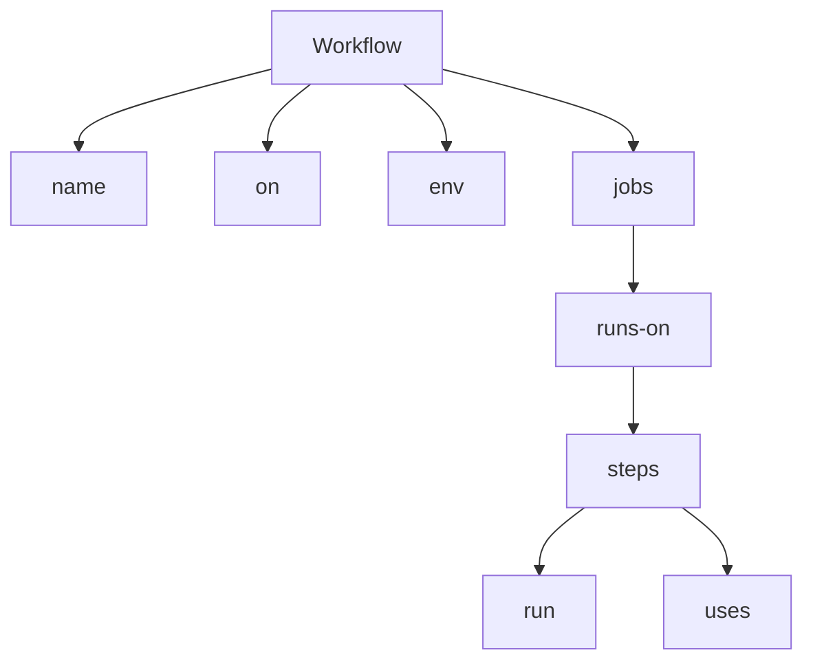

# Chapter 03: GitHub Actions Workflows

> **Level:** Beginner to Intermediate
>
> **Prerequisites:** GitHub Actions Fundamentals
>
> **Estimated Reading Time:** 35–45 Minutes

---

# 📖 Introduction

A workflow is the heart of GitHub Actions.

Whenever GitHub Actions performs automation, it executes a workflow.

Whether you want to:

- Build an application
- Execute unit tests
- Build Docker images
- Deploy to AWS
- Run Terraform
- Publish Releases

Everything starts with a workflow.

In this chapter, you'll learn how to create professional GitHub Actions workflows using YAML.

---

# 🎯 Learning Objectives

After completing this chapter, you will be able to:

- Understand workflow files
- Write YAML workflows
- Configure workflow triggers
- Create multiple jobs
- Use multiple steps
- Configure dependencies
- Use environment variables
- Build production-ready workflows

---

# 📑 Table of Contents

1. What is a Workflow?
2. Workflow File Location
3. YAML Basics
4. Workflow Structure
5. Workflow Lifecycle
6. First Workflow

---

# 1. What is a Workflow?

A **Workflow** is an automated process that defines how GitHub Actions should perform tasks inside a repository.

A workflow is written in **YAML** and stored inside the repository.

Think of a workflow as a blueprint for automation.

---

## Workflow Responsibilities

A workflow can:

- Build applications
- Execute tests
- Scan source code
- Build Docker images
- Deploy applications
- Upload artifacts
- Send notifications

---

## Real-world Example

Suppose a Java application is hosted on GitHub.

Whenever a developer pushes code:

1. Build starts automatically.
2. Unit tests execute.
3. Maven package is created.
4. Docker image is built.
5. Docker image is pushed.
6. Application is deployed to AWS.

All of this is controlled by a single workflow.

---

# 2. Workflow File Location

GitHub only recognizes workflow files stored in the following directory:

```text
.github/workflows/
```

Example:

```text
.github/

└── workflows/

    ├── build.yml

    ├── deploy.yml

    └── docker.yml
```

---

## Why This Folder?

GitHub automatically scans the `.github/workflows/` directory.

Whenever an event occurs, GitHub checks this folder for matching workflow definitions.

---

# 3. YAML Basics

GitHub Actions workflows use YAML.

YAML stands for:

> **YAML Ain't Markup Language**

YAML is designed to be simple and human-readable.

---

## YAML Rules

- Indentation is mandatory.
- Use spaces (not tabs).
- Keys end with `:`.
- Lists begin with `-`.

---

### Example

```yaml
name: Demo Workflow

on:
  push:

jobs:
  demo:
    runs-on: ubuntu-latest

    steps:

      - run: echo "Hello"
```

---

## YAML Hierarchy

```text
Workflow

│

├── name

├── on

└── jobs

      │

      └── steps
```

---

## Why Indentation Matters

Correct:

```yaml
jobs:

  build:

    runs-on: ubuntu-latest
```

Incorrect:

```yaml
jobs:

build:

runs-on: ubuntu-latest
```

Incorrect indentation causes workflow validation errors.

---

# 4. Workflow Structure

Every workflow follows the same high-level structure.

```yaml
name:

on:

env:

jobs:
```

---

## Workflow Diagram



---

## Workflow Lifecycle

```text
Developer

↓

Push Code

↓

GitHub Event

↓

Workflow Starts

↓

Runner Created

↓

Jobs Execute

↓

Steps Execute

↓

Workflow Completes
```

---

# 💼 Real-World Scenario

A developer commits a bug fix to the `develop` branch.

GitHub Actions:

- Detects the push event.
- Reads the workflow file.
- Creates an Ubuntu runner.
- Executes the build job.
- Runs tests.
- Publishes the build artifact.

The developer receives immediate feedback without performing any manual steps.

---

# ⚠ Common Mistakes

- Saving the workflow outside `.github/workflows/`
- Using tabs instead of spaces
- Incorrect YAML indentation
- Forgetting the `on` trigger
- Misspelling `runs-on`

---

# 🎯 Interview Tip

**Question**

Where should GitHub Actions workflow files be stored?

**Expected Answer**

Workflow files must be stored inside the `.github/workflows/` directory. GitHub automatically scans this location and executes workflows when configured events occur.

---

# 📝 Hands-on Exercise

Create a workflow named:

```
Learning Workflow
```

Requirements:

- Trigger using `workflow_dispatch`
- Run on Ubuntu
- Print:
  - Date
  - Hostname
  - Current User

---

# 🔑 Key Takeaways

- Workflows are the foundation of GitHub Actions.
- Workflow files use YAML.
- Store workflows in `.github/workflows/`.
- YAML indentation is critical.
- Every workflow begins with `name`, `on`, and `jobs`.

---

# ➡️ Next (Part 2)

We'll cover:

- Complete Workflow Syntax
- `name`
- `on`
- `env`
- `jobs`
- `runs-on`
- `steps`
- `run`
- `uses`
- Production Workflow Example
