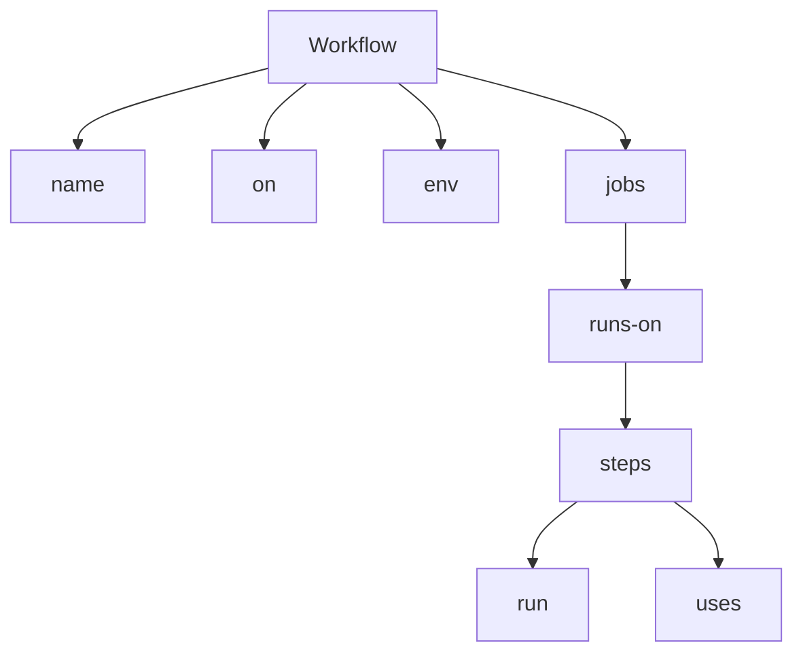
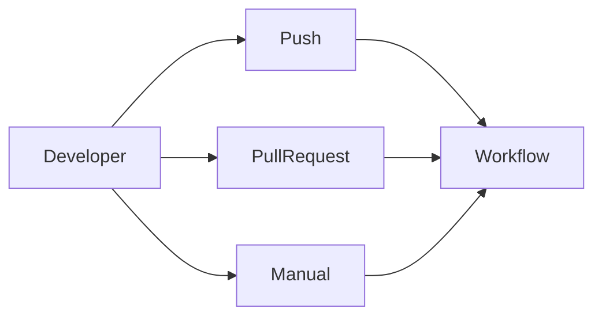
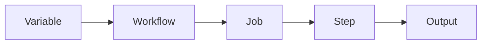
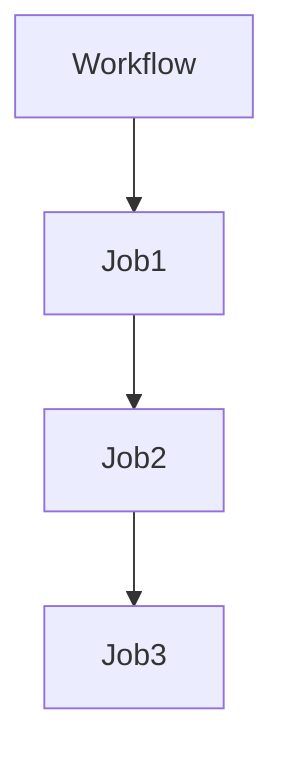
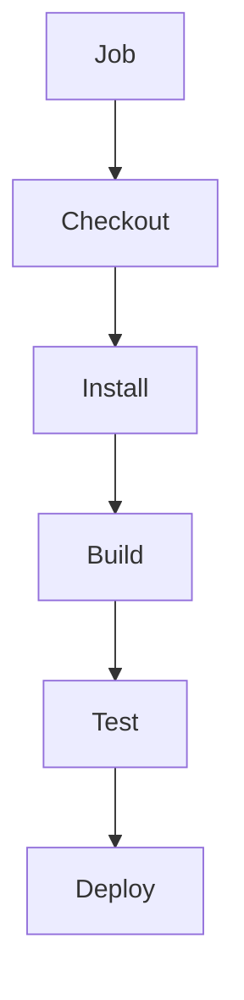

# Chapter 03: GitHub Actions Workflows

> **Level:** Beginner to Intermediate
>
> **Prerequisites:** GitHub Actions Fundamentals
>
> **Estimated Reading Time:** 35–45 Minutes

---

# 📖 Introduction

A workflow is the heart of GitHub Actions.

Whenever GitHub Actions performs automation, it executes a workflow.

Whether you want to:

- Build an application
- Execute unit tests
- Build Docker images
- Deploy to AWS
- Run Terraform
- Publish Releases

Everything starts with a workflow.

In this chapter, you'll learn how to create professional GitHub Actions workflows using YAML.

---

# 🎯 Learning Objectives

After completing this chapter, you will be able to:

- Understand workflow files
- Write YAML workflows
- Configure workflow triggers
- Create multiple jobs
- Use multiple steps
- Configure dependencies
- Use environment variables
- Build production-ready workflows

---

# 📑 Table of Contents

1. What is a Workflow?
2. Workflow File Location
3. YAML Basics
4. Workflow Structure
5. Workflow Lifecycle
6. First Workflow

---

# 1. What is a Workflow?

A **Workflow** is an automated process that defines how GitHub Actions should perform tasks inside a repository.

A workflow is written in **YAML** and stored inside the repository.

Think of a workflow as a blueprint for automation.

---

## Workflow Responsibilities

A workflow can:

- Build applications
- Execute tests
- Scan source code
- Build Docker images
- Deploy applications
- Upload artifacts
- Send notifications

---

## Real-world Example

Suppose a Java application is hosted on GitHub.

Whenever a developer pushes code:

1. Build starts automatically.
2. Unit tests execute.
3. Maven package is created.
4. Docker image is built.
5. Docker image is pushed.
6. Application is deployed to AWS.

All of this is controlled by a single workflow.

---

# 2. Workflow File Location

GitHub only recognizes workflow files stored in the following directory:

```text
.github/workflows/
```

Example:

```text
.github/

└── workflows/

    ├── build.yml

    ├── deploy.yml

    └── docker.yml
```

---

## Why This Folder?

GitHub automatically scans the `.github/workflows/` directory.

Whenever an event occurs, GitHub checks this folder for matching workflow definitions.

---

# 3. YAML Basics

GitHub Actions workflows use YAML.

YAML stands for:

> **YAML Ain't Markup Language**

YAML is designed to be simple and human-readable.

---

## YAML Rules

- Indentation is mandatory.
- Use spaces (not tabs).
- Keys end with `:`.
- Lists begin with `-`.

---

### Example

```yaml
name: Demo Workflow

on:
  push:

jobs:
  demo:
    runs-on: ubuntu-latest

    steps:

      - run: echo "Hello"
```

---

## YAML Hierarchy

```text
Workflow

│

├── name

├── on

└── jobs

      │

      └── steps
```

---

## Why Indentation Matters

Correct:

```yaml
jobs:

  build:

    runs-on: ubuntu-latest
```

Incorrect:

```yaml
jobs:

build:

runs-on: ubuntu-latest
```

Incorrect indentation causes workflow validation errors.

---

# 4. Workflow Structure

Every workflow follows the same high-level structure.

```yaml
name:

on:

env:

jobs:
```

---

## Workflow Diagram



---

## Workflow Lifecycle

```text
Developer

↓

Push Code

↓

GitHub Event

↓

Workflow Starts

↓

Runner Created

↓

Jobs Execute

↓

Steps Execute

↓

Workflow Completes
```

---

# 💼 Real-World Scenario

A developer commits a bug fix to the `develop` branch.

GitHub Actions:

- Detects the push event.
- Reads the workflow file.
- Creates an Ubuntu runner.
- Executes the build job.
- Runs tests.
- Publishes the build artifact.

The developer receives immediate feedback without performing any manual steps.

---

# ⚠ Common Mistakes

- Saving the workflow outside `.github/workflows/`
- Using tabs instead of spaces
- Incorrect YAML indentation
- Forgetting the `on` trigger
- Misspelling `runs-on`

---

# 🎯 Interview Tip

**Question**

Where should GitHub Actions workflow files be stored?

**Expected Answer**

Workflow files must be stored inside the `.github/workflows/` directory. GitHub automatically scans this location and executes workflows when configured events occur.

---

# 📝 Hands-on Exercise

Create a workflow named:

```
Learning Workflow
```

Requirements:

- Trigger using `workflow_dispatch`
- Run on Ubuntu
- Print:
  - Date
  - Hostname
  - Current User

---

# 🔑 Key Takeaways

- Workflows are the foundation of GitHub Actions.
- Workflow files use YAML.
- Store workflows in `.github/workflows/`.
- YAML indentation is critical.
- Every workflow begins with `name`, `on`, and `jobs`.

---

# ➡️ Next (Part 2)

We'll cover:

- Complete Workflow Syntax
- `name`
- `on`
- `env`
- `jobs`
- `runs-on`
- `steps`
- `run`
- `uses`
- Production Workflow Example

---

# 5. Workflow Keywords

Every GitHub Actions workflow is built using a few core keywords.

Understanding these keywords is essential because every workflow you write will use them.

---

## Workflow Overview


---

# name

## What is `name`?

The `name` keyword provides a human-readable name for the workflow.

This name appears in the **Actions** tab inside GitHub.

---

### Syntax

```yaml
name: Java CI Pipeline
```

---

### Example

```yaml
name: Build and Deploy Application
```

---

### Best Practice

Choose meaningful workflow names.

Good:

```yaml
name: Build Java Application
```

Bad:

```yaml
name: Demo
```

---

### Real-world Example

Instead of naming every workflow "Test", use names such as:

- Java Build
- Docker Build
- Deploy to AWS
- Terraform Pipeline

This helps team members quickly identify workflows.

---

# on

## What is `on`?

The `on` keyword specifies **when the workflow should execute**.

Without a trigger, GitHub never starts the workflow.

---

### Workflow Trigger Diagram



---

### Syntax

```yaml
on:
  push:
```

---

### Multiple Triggers

```yaml
on:

  push:

  pull_request:

  workflow_dispatch:
```

Meaning:

- Push
- Pull Request
- Manual Execution

---

### Interview Tip

**Question**

Why do we use `on`?

**Answer**

The `on` keyword defines the event that triggers the workflow.

---

# env

## What is `env`?

The `env` section stores environment variables.

Instead of repeating the same value multiple times, define it once.

---

### Syntax

```yaml
env:

  APP_NAME: ecommerce

  COMPANY: OpenTech
```

---

### Using Variables

```yaml
steps:

- run: echo $APP_NAME
```

Output

```
ecommerce
```

---

### Environment Variable Flow



---

### Benefits

- Centralized configuration

- Easy maintenance

- Cleaner workflows

---

# jobs

## What are Jobs?

A Job is a collection of related tasks executed on a runner.

Examples:

- Build

- Testing

- Security Scan

- Deployment

---

### Job Structure



---

### Example

```yaml
jobs:

  build:

  testing:

  deploy:
```

---

### Job Execution

By default:

Jobs execute **in parallel**.

If one job depends on another:

```yaml
needs: build
```

---

### Real-world Example

```
Build

↓

Testing

↓

Docker

↓

Deploy
```

---

# runs-on

## What is `runs-on`?

Specifies the operating system used to execute the workflow.

---

### Example

```yaml
runs-on: ubuntu-latest
```

---

### Available Options

```yaml
ubuntu-latest

windows-latest

macos-latest
```

---

### Runner Lifecycle

```mermaid
flowchart LR

Workflow

--> Runner Created

--> Job Executes

--> Runner Deleted
```

GitHub creates a fresh runner for every workflow execution.

---

# steps

## What are Steps?

A Step is an individual task inside a Job.

Examples:

- Checkout Code

- Install Java

- Maven Build

- Run Tests

- Upload Artifact

---

### Step Flow



---

### Example

```yaml
steps:

- run: pwd

- run: ls

- run: whoami
```

---

# run

## What is `run`?

The `run` keyword executes shell commands.

Example:

```yaml
steps:

- run: pwd

- run: hostname

- run: free -m
```

---

### Multiple Commands

```yaml
steps:

- run: |

    echo "Workflow Started"

    pwd

    date

    hostname

    free -m
```

---

# uses

## What is `uses`?

The `uses` keyword executes reusable GitHub Actions.

Instead of writing scripts manually, GitHub provides reusable Actions.

Example:

```yaml
- uses: actions/checkout@v4
```

---

### Difference

| run | uses |
|------|------|
| Executes shell commands | Executes reusable Actions |

---

### Example

```yaml
steps:

- uses: actions/checkout@v4

- run: ls
```

---

# Complete Workflow Example

```yaml
name: Java CI

on:

  push:

env:

  APP_NAME: ecommerce

jobs:

  build:

    runs-on: ubuntu-latest

    steps:

      - uses: actions/checkout@v4

      - run: echo $APP_NAME

      - run: mvn clean package
```

---

# Best Practices

✅ Keep workflow names meaningful

✅ Keep jobs independent

✅ Use environment variables

✅ Use official GitHub Actions

✅ Split Build, Test, Deploy into separate jobs

---

# Common Mistakes

❌ Wrong indentation

❌ Forgetting `on`

❌ Using tabs

❌ Writing huge workflows

❌ Hardcoding values

---

# Hands-on Exercise

Create a workflow that:

- Uses `workflow_dispatch`

- Creates one Build Job

- Prints:

  - date

  - hostname

  - free -m

  - whoami

- Uses `actions/checkout@v4`

---

# Key Takeaways

- Every workflow starts with `name`, `on`, and `jobs`.
- Jobs execute on runners.
- Steps perform tasks.
- `run` executes shell commands.
- `uses` executes reusable Actions.
- Environment variables reduce duplication.

---

# ➡️ Next (Part 3)

We'll build **real production workflows**, including:

- Java Maven CI Pipeline
- Node.js CI Pipeline
- Docker Build Workflow
- Multi-Job CI Pipeline
- Artifact Upload
- Production Workflow Diagram
