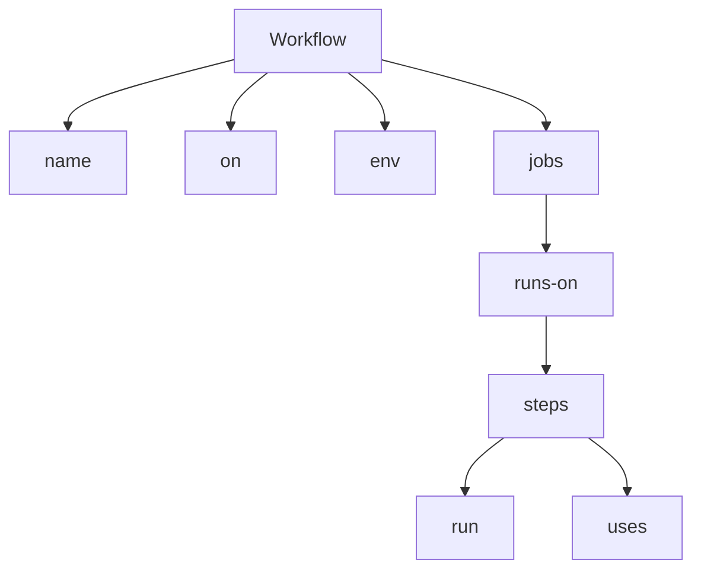
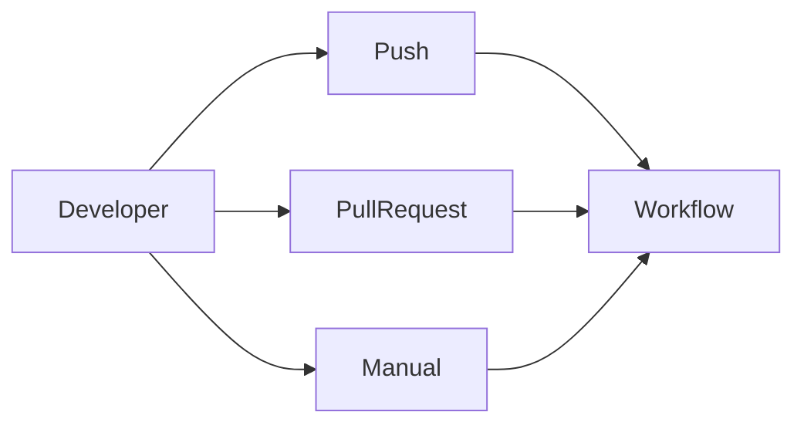
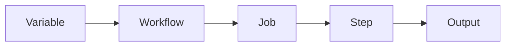
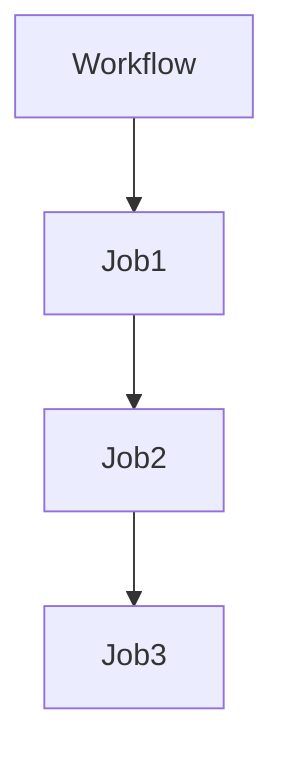
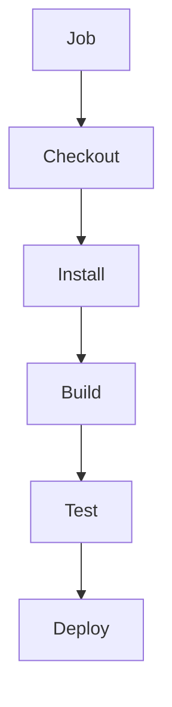
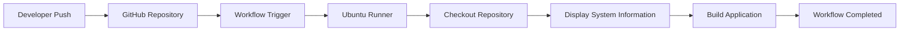
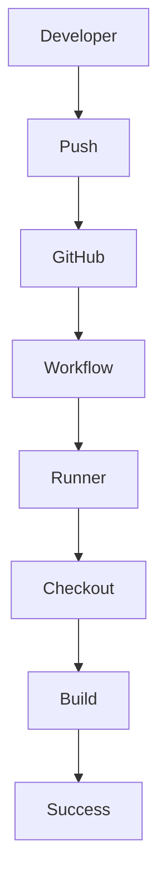
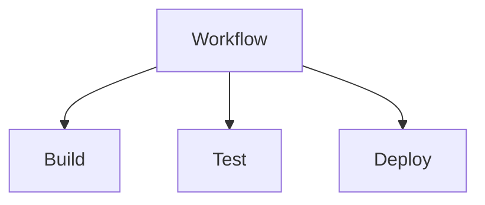
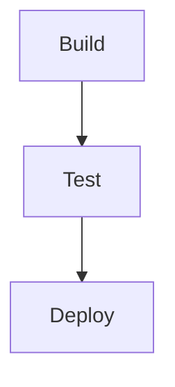
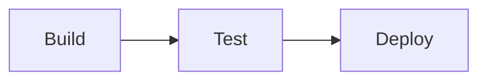

# Chapter 03: GitHub Actions Workflows

> **Level:** Beginner to Intermediate
>
> **Prerequisites:** GitHub Actions Fundamentals
>
> **Estimated Reading Time:** 35–45 Minutes

---

# 📖 Introduction

A workflow is the heart of GitHub Actions.

Whenever GitHub Actions performs automation, it executes a workflow.

Whether you want to:

- Build an application
- Execute unit tests
- Build Docker images
- Deploy to AWS
- Run Terraform
- Publish Releases

Everything starts with a workflow.

In this chapter, you'll learn how to create professional GitHub Actions workflows using YAML.

---

# 🎯 Learning Objectives

After completing this chapter, you will be able to:

- Understand workflow files
- Write YAML workflows
- Configure workflow triggers
- Create multiple jobs
- Use multiple steps
- Configure dependencies
- Use environment variables
- Build production-ready workflows

---

# 📑 Table of Contents

1. What is a Workflow?
2. Workflow File Location
3. YAML Basics
4. Workflow Structure
5. Workflow Lifecycle
6. First Workflow

---

# 1. What is a Workflow?

A **Workflow** is an automated process that defines how GitHub Actions should perform tasks inside a repository.

A workflow is written in **YAML** and stored inside the repository.

Think of a workflow as a blueprint for automation.

---

## Workflow Responsibilities

A workflow can:

- Build applications
- Execute tests
- Scan source code
- Build Docker images
- Deploy applications
- Upload artifacts
- Send notifications

---

## Real-world Example

Suppose a Java application is hosted on GitHub.

Whenever a developer pushes code:

1. Build starts automatically.
2. Unit tests execute.
3. Maven package is created.
4. Docker image is built.
5. Docker image is pushed.
6. Application is deployed to AWS.

All of this is controlled by a single workflow.

---

# 2. Workflow File Location

GitHub only recognizes workflow files stored in the following directory:

```text
.github/workflows/
```

Example:

```text
.github/

└── workflows/

    ├── build.yml

    ├── deploy.yml

    └── docker.yml
```

---

## Why This Folder?

GitHub automatically scans the `.github/workflows/` directory.

Whenever an event occurs, GitHub checks this folder for matching workflow definitions.

---

# 3. YAML Basics

GitHub Actions workflows use YAML.

YAML stands for:

> **YAML Ain't Markup Language**

YAML is designed to be simple and human-readable.

---

## YAML Rules

- Indentation is mandatory.
- Use spaces (not tabs).
- Keys end with `:`.
- Lists begin with `-`.

---

### Example

```yaml
name: Demo Workflow

on:
  push:

jobs:
  demo:
    runs-on: ubuntu-latest

    steps:

      - run: echo "Hello"
```

---

## YAML Hierarchy

```text
Workflow

│

├── name

├── on

└── jobs

      │

      └── steps
```

---

## Why Indentation Matters

Correct:

```yaml
jobs:

  build:

    runs-on: ubuntu-latest
```

Incorrect:

```yaml
jobs:

build:

runs-on: ubuntu-latest
```

Incorrect indentation causes workflow validation errors.

---

# 4. Workflow Structure

Every workflow follows the same high-level structure.

```yaml
name:

on:

env:

jobs:
```

---

## Workflow Diagram



---

## Workflow Lifecycle

```text
Developer

↓

Push Code

↓

GitHub Event

↓

Workflow Starts

↓

Runner Created

↓

Jobs Execute

↓

Steps Execute

↓

Workflow Completes
```

---

# 💼 Real-World Scenario

A developer commits a bug fix to the `develop` branch.

GitHub Actions:

- Detects the push event.
- Reads the workflow file.
- Creates an Ubuntu runner.
- Executes the build job.
- Runs tests.
- Publishes the build artifact.

The developer receives immediate feedback without performing any manual steps.

---

# ⚠ Common Mistakes

- Saving the workflow outside `.github/workflows/`
- Using tabs instead of spaces
- Incorrect YAML indentation
- Forgetting the `on` trigger
- Misspelling `runs-on`

---

# 🎯 Interview Tip

**Question**

Where should GitHub Actions workflow files be stored?

**Expected Answer**

Workflow files must be stored inside the `.github/workflows/` directory. GitHub automatically scans this location and executes workflows when configured events occur.

---

# 📝 Hands-on Exercise

Create a workflow named:

```
Learning Workflow
```

Requirements:

- Trigger using `workflow_dispatch`
- Run on Ubuntu
- Print:
  - Date
  - Hostname
  - Current User

---

# 🔑 Key Takeaways

- Workflows are the foundation of GitHub Actions.
- Workflow files use YAML.
- Store workflows in `.github/workflows/`.
- YAML indentation is critical.
- Every workflow begins with `name`, `on`, and `jobs`.

---

# ➡️ Next (Part 2)

We'll cover:

- Complete Workflow Syntax
- `name`
- `on`
- `env`
- `jobs`
- `runs-on`
- `steps`
- `run`
- `uses`
- Production Workflow Example

---

# 5. Workflow Keywords

Every GitHub Actions workflow is built using a few core keywords.

Understanding these keywords is essential because every workflow you write will use them.

---

## Workflow Overview


---

# name

## What is `name`?

The `name` keyword provides a human-readable name for the workflow.

This name appears in the **Actions** tab inside GitHub.

---

### Syntax

```yaml
name: Java CI Pipeline
```

---

### Example

```yaml
name: Build and Deploy Application
```

---

### Best Practice

Choose meaningful workflow names.

Good:

```yaml
name: Build Java Application
```

Bad:

```yaml
name: Demo
```

---

### Real-world Example

Instead of naming every workflow "Test", use names such as:

- Java Build
- Docker Build
- Deploy to AWS
- Terraform Pipeline

This helps team members quickly identify workflows.

---

# on

## What is `on`?

The `on` keyword specifies **when the workflow should execute**.

Without a trigger, GitHub never starts the workflow.

---

### Workflow Trigger Diagram



---

### Syntax

```yaml
on:
  push:
```

---

### Multiple Triggers

```yaml
on:

  push:

  pull_request:

  workflow_dispatch:
```

Meaning:

- Push
- Pull Request
- Manual Execution

---

### Interview Tip

**Question**

Why do we use `on`?

**Answer**

The `on` keyword defines the event that triggers the workflow.

---

# env

## What is `env`?

The `env` section stores environment variables.

Instead of repeating the same value multiple times, define it once.

---

### Syntax

```yaml
env:

  APP_NAME: ecommerce

  COMPANY: OpenTech
```

---

### Using Variables

```yaml
steps:

- run: echo $APP_NAME
```

Output

```
ecommerce
```

---

### Environment Variable Flow



---

### Benefits

- Centralized configuration

- Easy maintenance

- Cleaner workflows

---

# jobs

## What are Jobs?

A Job is a collection of related tasks executed on a runner.

Examples:

- Build

- Testing

- Security Scan

- Deployment

---

### Job Structure



---

### Example

```yaml
jobs:

  build:

  testing:

  deploy:
```

---

### Job Execution

By default:

Jobs execute **in parallel**.

If one job depends on another:

```yaml
needs: build
```

---

### Real-world Example

```
Build

↓

Testing

↓

Docker

↓

Deploy
```

---

# runs-on

## What is `runs-on`?

Specifies the operating system used to execute the workflow.

---

### Example

```yaml
runs-on: ubuntu-latest
```

---

### Available Options

```yaml
ubuntu-latest

windows-latest

macos-latest
```

---

### Runner Lifecycle

```mermaid
flowchart LR

Workflow

--> Runner Created

--> Job Executes

--> Runner Deleted
```

GitHub creates a fresh runner for every workflow execution.

---

# steps

## What are Steps?

A Step is an individual task inside a Job.

Examples:

- Checkout Code

- Install Java

- Maven Build

- Run Tests

- Upload Artifact

---

### Step Flow



---

### Example

```yaml
steps:

- run: pwd

- run: ls

- run: whoami
```

---

# run

## What is `run`?

The `run` keyword executes shell commands.

Example:

```yaml
steps:

- run: pwd

- run: hostname

- run: free -m
```

---

### Multiple Commands

```yaml
steps:

- run: |

    echo "Workflow Started"

    pwd

    date

    hostname

    free -m
```

---

# uses

## What is `uses`?

The `uses` keyword executes reusable GitHub Actions.

Instead of writing scripts manually, GitHub provides reusable Actions.

Example:

```yaml
- uses: actions/checkout@v4
```

---

### Difference

| run | uses |
|------|------|
| Executes shell commands | Executes reusable Actions |

---

### Example

```yaml
steps:

- uses: actions/checkout@v4

- run: ls
```

---

# Complete Workflow Example

```yaml
name: Java CI

on:

  push:

env:

  APP_NAME: ecommerce

jobs:

  build:

    runs-on: ubuntu-latest

    steps:

      - uses: actions/checkout@v4

      - run: echo $APP_NAME

      - run: mvn clean package
```

---

# Best Practices

✅ Keep workflow names meaningful

✅ Keep jobs independent

✅ Use environment variables

✅ Use official GitHub Actions

✅ Split Build, Test, Deploy into separate jobs

---

# Common Mistakes

❌ Wrong indentation

❌ Forgetting `on`

❌ Using tabs

❌ Writing huge workflows

❌ Hardcoding values

---

# Hands-on Exercise

Create a workflow that:

- Uses `workflow_dispatch`

- Creates one Build Job

- Prints:

  - date

  - hostname

  - free -m

  - whoami

- Uses `actions/checkout@v4`

---

# Key Takeaways

- Every workflow starts with `name`, `on`, and `jobs`.
- Jobs execute on runners.
- Steps perform tasks.
- `run` executes shell commands.
- `uses` executes reusable Actions.
- Environment variables reduce duplication.

---

# ➡️ Next (Part 3)

We'll build **real production workflows**, including:

- Java Maven CI Pipeline
- Node.js CI Pipeline
- Docker Build Workflow
- Multi-Job CI Pipeline
- Artifact Upload
- Production Workflow Diagram

---

# 6. Building Your First Production Workflow

In previous sections, we learned the structure of a workflow.

Now let's build a real workflow step by step.

---

# Workflow Goal

Whenever a developer pushes code:

- Checkout source code
- Display system information
- Build application
- Complete successfully

---

## Complete Execution Flow



---

# Step 1 — Create Workflow File

Location:

```text
.github/workflows/
```

File:

```text
build.yml
```

---

# Step 2 — Complete Workflow

```yaml
name: Build Application

on:
  push:

jobs:

  build:

    runs-on: ubuntu-latest

    steps:

      - name: Checkout Repository
        uses: actions/checkout@v4

      - name: Display Current Directory
        run: pwd

      - name: Display Files
        run: ls -la

      - name: Display Date
        run: date

      - name: Display Hostname
        run: hostname

      - name: Display Current User
        run: whoami

      - name: Display Memory
        run: free -m

      - name: Display Disk Usage
        run: df -h
```

---

# Workflow Explanation

## Checkout Repository

```yaml
- uses: actions/checkout@v4
```

Downloads the repository into the runner.

Without checkout:

```
Runner

↓

Empty Folder
```

With checkout:

```
Runner

↓

Repository Files

↓

Workflow Can Access Source Code
```

---

## System Information

```yaml
run: pwd
```

Prints the current working directory.

---

```yaml
run: ls -la
```

Displays all repository files.

---

```yaml
run: hostname
```

Displays the runner hostname.

---

```yaml
run: whoami
```

Displays the current user.

---

```yaml
run: free -m
```

Displays memory information.

---

```yaml
run: df -h
```

Displays disk usage.

---

# Complete Workflow Lifecycle



---

# Real-world Example

Suppose a Java developer pushes new code.

GitHub Actions automatically:

- Downloads source code
- Displays environment information
- Installs Java
- Executes Maven Build
- Runs Unit Tests
- Uploads Build Artifact

No manual work is required.

---

# Why Checkout is Important

Many beginners forget this step.

Without:

```yaml
uses: actions/checkout@v4
```

The runner cannot access:

- Java Source Code
- package.json
- pom.xml
- Dockerfile
- Terraform Files

---

# Common Mistakes

❌ Forgetting checkout

❌ Wrong indentation

❌ Wrong trigger

❌ Wrong runner name

❌ Invalid YAML syntax

---

# Best Practices

✅ Use descriptive step names

✅ Keep each step focused

✅ Separate build and deployment

✅ Use official GitHub Actions

---

# Interview Question

## Why is `actions/checkout` required?

### Expected Answer

`actions/checkout` downloads the repository source code into the GitHub Actions runner. Without it, the workflow cannot access project files such as source code, configuration files, or build scripts.

---

# Hands-on Exercise

Create a workflow that:

- Executes on Push
- Uses checkout
- Prints:
  - pwd
  - hostname
  - date
  - whoami
  - free -m
  - df -h

Observe the logs in the **Actions** tab after pushing your changes.

---

# Key Takeaways

- `actions/checkout` is usually the first step in a workflow.
- The runner starts with a clean environment.
- Each `run` step executes shell commands.
- System information commands are useful for learning and troubleshooting.

---

# ➡️ Next (Part 4)

We'll build:

- Java Maven CI Pipeline
- Multiple Jobs
- Job Dependencies
- Artifact Upload
- Production CI Workflow

---

# 7. Java Maven CI Pipeline

One of the most common use cases of GitHub Actions is building Java applications using Maven.

Whenever a developer pushes code:

- Source code is downloaded
- Java is installed
- Maven dependencies are downloaded
- Application is compiled
- Unit tests execute
- JAR/WAR file is generated

Everything happens automatically.

---

# CI Pipeline Architecture

```mermaid
flowchart LR

Developer

--> Push

--> GitHub

--> Workflow

--> Checkout

--> Setup Java

--> Maven Build

--> Unit Test

--> Package

--> Success
```

---

# Complete Java Maven Workflow

```yaml
name: Java Maven CI

on:

  push:

    branches:

      - main

jobs:

  build:

    runs-on: ubuntu-latest

    steps:

      - name: Checkout Repository

        uses: actions/checkout@v4

      - name: Setup Java

        uses: actions/setup-java@v4

        with:

          distribution: temurin

          java-version: '17'

      - name: Verify Java Version

        run: java -version

      - name: Build Application

        run: mvn clean package

      - name: Run Tests

        run: mvn test
```

---

# Workflow Explanation

## Step 1

Checkout downloads the repository.

```
Repository

↓

Runner
```

---

## Step 2

Setup Java installs Java 17.

```
Runner

↓

Install Java

↓

JAVA_HOME Configured
```

---

## Step 3

Verify installation.

```bash
java -version
```

---

## Step 4

Compile the application.

```bash
mvn clean package
```

This command:

- Cleans previous builds
- Downloads dependencies
- Compiles source code
- Creates a package

---

## Step 5

Execute unit tests.

```bash
mvn test
```

---

# Maven Build Flow

```mermaid
flowchart TD

Checkout

-->

Install Java

-->

Download Dependencies

-->

Compile

-->

Test

-->

Package

-->

Success
```

---

# Expected Output

```
BUILD SUCCESS
```

---

# Real-world Example

Suppose your LMS project uses:

- Java
- Spring Boot
- Maven

Whenever developers push code:

GitHub Actions automatically:

- Builds the project
- Executes unit tests
- Creates JAR file
- Uploads artifact
- Deploys to Tomcat

No manual intervention.

---

# Common Build Commands

```bash
mvn clean

mvn compile

mvn test

mvn package

mvn install
```

---

# Build Lifecycle

```text
Source Code

↓

Compile

↓

Test

↓

Package

↓

Artifact
```

---

# Common Mistakes

❌ Wrong Java version

❌ Missing pom.xml

❌ Maven not installed

❌ Build before Checkout

❌ Wrong working directory

---

# Best Practices

✅ Use LTS Java version

✅ Run tests before deployment

✅ Keep build and deployment separate

✅ Cache dependencies (advanced topic)

---

# Interview Questions

### Why do we use `actions/setup-java`?

It installs and configures Java on the GitHub Actions runner.

---

### Why execute `mvn test`?

To ensure code quality before deployment.

---

### Difference between

```
mvn compile
```

and

```
mvn package
```

Expected Answer

Compile creates `.class` files.

Package creates deployable artifacts like JAR or WAR.

---

# Hands-on Exercise

Create a Java Maven workflow that:

- Executes on Push
- Installs Java 17
- Runs

```
mvn clean package
```

- Executes

```
mvn test
```

Observe the logs inside GitHub Actions.

---

# Key Takeaways

- Java is installed using `actions/setup-java`.
- Maven builds Java applications.
- Unit testing should always execute before deployment.
- CI pipelines improve software quality.

---

# ➡️ Next (Part 5)

We'll build:

- Multi-Job Pipeline
- Upload Artifacts
- Dependency Pipelines
- Production CI Pipeline
- Complete CI/CD Architecture

---

# 8. Multi-Job Workflow

In real-world CI/CD pipelines, all tasks are **not executed in a single job**.

Instead, the workflow is divided into multiple independent jobs.

For example:

- Build
- Test
- Security Scan
- Package
- Deploy

Each job performs one responsibility.

---

# Why Multiple Jobs?

Suppose you have a Spring Boot application.

The workflow should:

1. Build the application.
2. Execute unit tests.
3. Deploy only if the build succeeds.

Instead of placing everything inside one job, we separate them.

Advantages:

- Easier debugging
- Better readability
- Faster execution
- Independent execution

---

# Multi-Job Architecture

```mermaid
flowchart LR

Developer

-->

Push

-->

Workflow

-->

Build Job

-->

Test Job

-->

Deploy Job
```

---

# Example Workflow

```yaml
name: Multi Job Pipeline

on:

  workflow_dispatch:

jobs:

  build:

    runs-on: ubuntu-latest

    steps:

      - uses: actions/checkout@v4

      - run: echo "Building Application"

  test:

    runs-on: ubuntu-latest

    steps:

      - run: echo "Running Unit Tests"

  deploy:

    runs-on: ubuntu-latest

    steps:

      - run: echo "Deploying Application"
```

---

# Workflow Execution

```text
Workflow

│

├── Build

├── Test

└── Deploy
```

By default, these jobs execute **in parallel**.

---

# Parallel Execution



GitHub creates separate runners for each job.

---

# Real-World Example

A company develops an online banking application.

The workflow contains:

```
Build

↓

Unit Test

↓

Security Scan

↓

Docker Build

↓

Deploy
```

Each task is implemented as an individual job.

---

# 9. Job Dependencies

Sometimes jobs must execute in sequence.

Example:

Deployment should only happen after a successful build.

GitHub provides:

```yaml
needs:
```

---

# Dependency Diagram



---

# Example

```yaml
jobs:

  build:

    runs-on: ubuntu-latest

    steps:

      - run: echo "Build Successful"

  test:

    needs: build

    runs-on: ubuntu-latest

    steps:

      - run: echo "Testing"

  deploy:

    needs: test

    runs-on: ubuntu-latest

    steps:

      - run: echo "Deploying"
```

---

# Execution Order

```
Build

↓

Test

↓

Deploy
```

Unlike parallel execution, each job waits until the previous one completes successfully.

---

# Why Use `needs`?

Without dependencies:

```
Build

Deploy

Test
```

Deployment might begin before testing is complete.

With dependencies:

```
Build

↓

Test

↓

Deploy
```

The workflow becomes safe and predictable.

---

# Dependency Flow



---

# Real-World Scenario

Your AWS deployment pipeline might look like:

```
Checkout

↓

Build

↓

Unit Test

↓

SonarQube Scan

↓

Docker Build

↓

Push Docker Image

↓

Deploy to EC2
```

Each stage depends on the previous one.

---

# Common Mistakes

❌ Deploy before testing

❌ Put everything in one job

❌ Create unnecessary dependencies

❌ Forget `needs`

---

# Best Practices

✅ Separate Build, Test, and Deploy

✅ Use `needs` only when required

✅ Keep jobs independent

✅ Give meaningful job names

---

# Interview Questions

### What is the default execution behavior of jobs?

**Answer:**

Jobs execute in parallel unless dependencies are defined.

---

### How do you execute jobs sequentially?

**Answer:**

Use the `needs` keyword.

Example:

```yaml
deploy:

  needs: build
```

---

### Difference Between Job and Step

| Job | Step |
|------|------|
| Collection of related tasks | Individual task |
| Executes on a Runner | Executes inside a Job |
| Can execute in parallel | Executes sequentially |

---

# Hands-on Exercise

Create a workflow containing:

- Build Job
- Test Job
- Deploy Job

Configure:

- Test depends on Build
- Deploy depends on Test

Run the workflow manually and observe the execution graph in the **Actions** tab.

---

# Key Takeaways

- Large workflows should be split into multiple jobs.
- Jobs execute in parallel by default.
- Use `needs` to control execution order.
- Separating responsibilities makes workflows easier to maintain.

---

# ➡️ Next (Part 6)

We'll learn:

- Upload Artifacts
- Download Artifacts
- Build Outputs
- Production Artifact Workflow
- Complete Enterprise CI Pipeline

---

# 10. Uploading Build Artifacts

After building an application, we usually want to save the generated files.

Examples include:

- JAR Files
- WAR Files
- ZIP Packages
- Reports
- Test Results
- Coverage Reports

These files are called **Artifacts**.

---

# Why Upload Artifacts?

Without artifacts:

```
Workflow

↓

Build

↓

Runner Deleted

↓

Build Output Lost
```

With artifacts:

```
Workflow

↓

Build

↓

Upload Artifact

↓

GitHub Stores Artifact

↓

Download Anytime
```

---

# Artifact Workflow

```mermaid
flowchart LR

Developer

-->

Push

-->

Workflow

-->

Build

-->

Artifact

-->

GitHub Storage
```

---

# Upload Artifact Example

```yaml
name: Upload Artifact

on:

  workflow_dispatch:

jobs:

  build:

    runs-on: ubuntu-latest

    steps:

      - uses: actions/checkout@v4

      - run: mkdir output

      - run: echo "Hello GitHub Actions" > output/result.txt

      - name: Upload Artifact

        uses: actions/upload-artifact@v4

        with:

          name: Build-Output

          path: output/
```

---

# Artifact Upload Flow

```mermaid
flowchart TD

Build

-->

Output Folder

-->

Upload Artifact

-->

GitHub Artifact Storage
```

---

# Download Artifact

Artifacts uploaded by one job can be downloaded in another job.

Example:

```yaml
- uses: actions/download-artifact@v4

  with:

    name: Build-Output
```

---

# Complete Build Flow

```mermaid
flowchart LR

Checkout

-->

Build

-->

Test

-->

Package

-->

Upload Artifact

-->

Deploy
```

---

# Real-world Example

Suppose your Spring Boot application creates:

```
target/

app.jar
```

Instead of rebuilding in every deployment job:

```
Build

↓

Upload JAR

↓

Deploy Job

↓

Download JAR

↓

Deploy
```

This saves build time.

---

# Enterprise CI Pipeline

Large companies rarely use a single job.

A production pipeline may look like:

```mermaid
flowchart LR

Developer

-->

Push

-->

Build

-->

Unit Test

-->

Integration Test

-->

SonarQube

-->

Security Scan

-->

Package

-->

Upload Artifact

-->

Docker Build

-->

Push Image

-->

Deploy Dev

-->

Deploy QA

-->

Deploy Production
```

---

# Enterprise Workflow Advantages

- Faster deployments

- Better quality

- Security validation

- Easy rollback

- Build once, deploy many

---

# Common Mistakes

❌ Forgetting to upload build output

❌ Uploading unnecessary files

❌ Large artifacts

❌ Wrong artifact path

---

# Best Practices

✅ Upload only required files

✅ Use meaningful artifact names

✅ Build once

✅ Deploy the same artifact everywhere

---

# Interview Questions

### What is an Artifact?

A build output stored by GitHub Actions for later use.

Examples:

- JAR

- WAR

- ZIP

- HTML Report

---

### Why upload artifacts?

To reuse build outputs across jobs or download them later without rebuilding the application.

---

### Difference between Cache and Artifact?

| Cache | Artifact |
|--------|----------|
| Speeds up builds | Stores build outputs |
| Dependency reuse | Deliverable reuse |
| Temporary | Downloadable |

---

# Hands-on Exercise

Create a workflow that:

- Creates a folder named `reports`
- Generates `report.txt`
- Uploads it as an artifact
- Downloads it in another job

Observe the artifact in the **Actions** page after the workflow completes.

---

# Chapter 3 Summary

In this chapter you learned:

- Workflow Files
- YAML Structure
- Workflow Keywords
- Jobs
- Steps
- run
- uses
- Java Maven Pipeline
- Multiple Jobs
- Job Dependencies
- Upload Artifacts
- Download Artifacts
- Enterprise Pipelines

---

# Key Takeaways

- Workflows define automation.
- Jobs organize related tasks.
- Steps perform individual actions.
- `uses` runs reusable Actions.
- Artifacts preserve build outputs.
- Enterprise pipelines separate Build, Test, Package, and Deploy.

---

# What's Next?

## Chapter 04 – Workflow Events

Topics include:

- Push Events
- Pull Request Events
- Scheduled Events
- Release Events
- Branch Filters
- Path Filters
- Manual Triggers
- Event Filters
- Production Event Strategies
