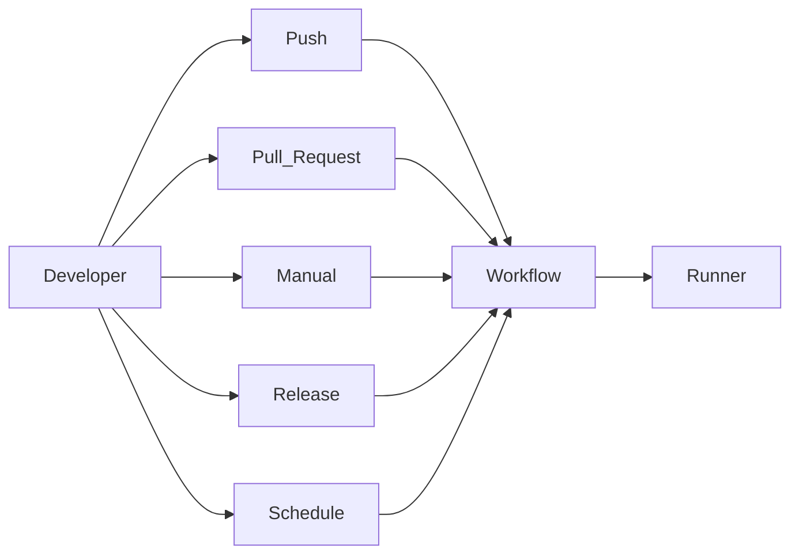
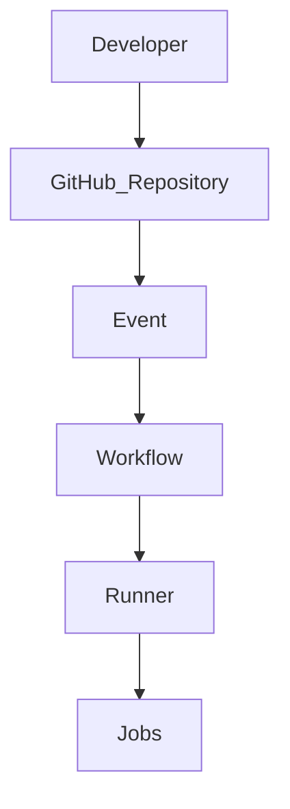
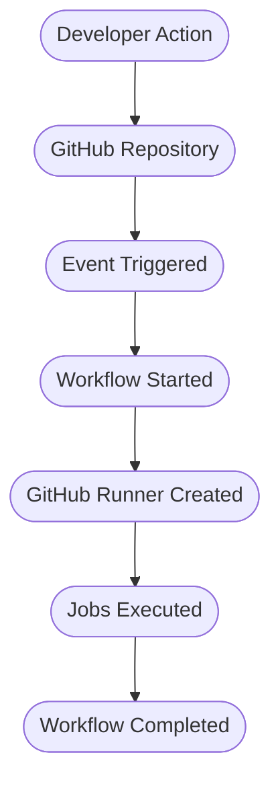
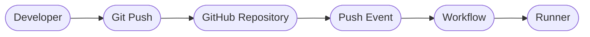
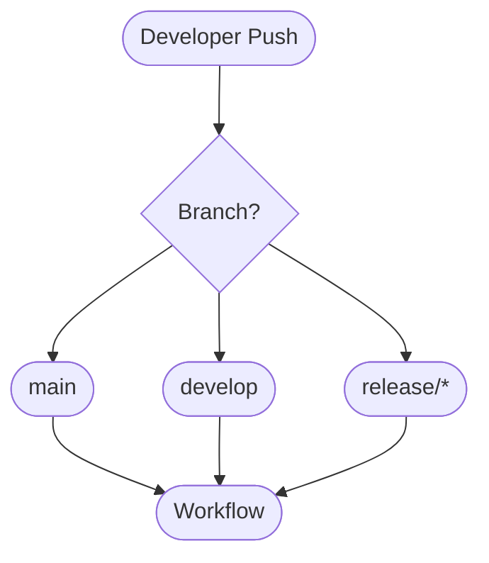
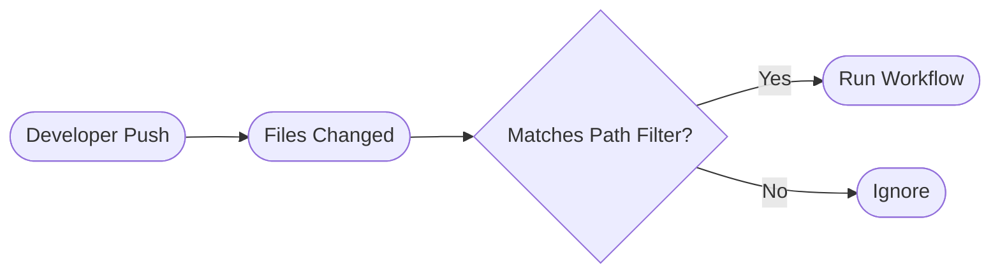

# Chapter 04: GitHub Actions Workflow Events

> **Level:** Beginner to Intermediate
>
> **Prerequisites:** GitHub Actions Fundamentals
>
> **Estimated Reading Time:** 35 Minutes

---

# 📖 Introduction

A workflow without an event will never execute.

Events tell GitHub **when** a workflow should start.

Whenever an event occurs, GitHub checks the repository for matching workflow files and executes them automatically.

Think of an event as a trigger that starts the automation process.

---

# 🎯 Learning Objectives

After completing this chapter, you will understand:

- What are Workflow Events
- Push Event
- Pull Request Event
- Manual Event
- Schedule Event
- Release Event
- Branch Filters
- Path Filters
- Multiple Triggers
- Production Trigger Strategies

---

# Workflow Event Architecture



---

# What is an Event?

An Event is an activity that occurs inside a GitHub repository.

Examples include:

- Pushing code
- Opening a Pull Request
- Creating a Release
- Clicking "Run Workflow"
- Scheduled execution

Whenever these activities occur, GitHub can automatically start a workflow.

---

# Event Flow


---

# Common Events

| Event | Description |
|--------|-------------|
| push | Trigger when code is pushed |
| pull_request | Trigger on Pull Requests |
| workflow_dispatch | Manual execution |
| schedule | Scheduled execution |
| release | Release published |

---

# Why Events Matter

Imagine an application with:

- 50 Developers
- Hundreds of Commits
- Multiple Releases every week

Running workflows manually every time would be impossible.

Events automate this process.

---

# Real-world Example

Developer pushes code.

↓

GitHub detects Push Event.

↓

Workflow starts.

↓

Runner created.

↓

Application builds automatically.

↓

Tests execute.

↓

Deployment begins.

---

## 🔄 Event Lifecycle



---

# Benefits

- Complete Automation

- No Manual Work

- Faster Delivery

- Immediate Feedback

- Consistent Deployments

---

# Interview Tip

### Question

What is an Event?

### Expected Answer

An Event is an activity that occurs inside a GitHub repository and triggers a GitHub Actions workflow.

Examples include Push, Pull Request, Manual Execution, Release, and Schedule.

---

# Common Mistakes

❌ Forgetting to define an event

❌ Wrong event syntax

❌ Using incorrect branch filters

❌ Triggering unnecessary workflows

---

# Best Practices

✅ Trigger workflows only when necessary

✅ Filter by branch

✅ Filter by path

✅ Use manual triggers for production deployments

---

# Hands-on Exercise

Create a workflow that:

- Executes only on Push
- Prints

  - Date

  - Hostname

  - Current User

Push code and observe the Actions tab.

---

# Key Takeaways

- Events trigger workflows.
- Without an event, a workflow never starts.
- GitHub supports many event types.
- Events can be filtered for better control.

---

# ➡️ Next (Part 2)

We'll cover:

- Push Event
- Push on Specific Branch
- Branch Filters
- Multiple Branches
- Tag Events

---

# 🚀 Push Event

The **Push Event** is the most commonly used trigger in GitHub Actions.

Whenever a developer pushes code to a repository, GitHub automatically starts the workflow.

---

## Push Event Architecture



---

## Basic Push Trigger

```yaml
on:
  push:
```

This workflow executes whenever code is pushed to any branch.

---

## Real-world Example

Developer pushes new code.

↓

GitHub detects Push Event.

↓

Workflow starts automatically.

↓

Application builds.

↓

Tests execute.

↓

Deployment begins.

---

# Push on Specific Branch

In production environments, workflows should not execute for every branch.

Instead, trigger workflows only on important branches.

Example:

```yaml
on:

  push:

    branches:

      - main
```

Only pushes to the **main** branch trigger the workflow.

---

# Multiple Branches

You can monitor multiple branches.

```yaml
on:

  push:

    branches:

      - main

      - develop

      - release/**
```

---

## Branch Flow



---

## Real-world Example

Repository contains:

```
main

develop

feature/login

feature/payment

release/v1
```

Workflow executes only on:

- main
- develop
- release/*

Feature branches are ignored.

---

# Ignoring Branches

Sometimes certain branches should never trigger workflows.

Example:

```yaml
on:

  push:

    branches-ignore:

      - experimental

      - test/*
```

---

# Tag Events

GitHub can trigger workflows whenever tags are pushed.

Example:

```yaml
on:

  push:

    tags:

      - v*
```

---

## Tag Workflow

```
Developer

↓

Create Tag

↓

Push Tag

↓

Workflow Executes
```

---

# Path Filters

Sometimes only specific files should trigger workflows.

Example:

```yaml
on:

  push:

    paths:

      - src/**

      - pom.xml
```

Workflow executes only when:

- Source code changes
- pom.xml changes

---

## Ignore Paths

Example:

```yaml
on:

  push:

    paths-ignore:

      - README.md

      - docs/**
```

Documentation changes will not trigger the workflow.

---

## Path Filter Architecture



---

# Branch vs Path Filter

| Branch Filter | Path Filter |
|--------------|-------------|
| Filters branches | Filters files |
| Example: main | Example: src/** |
| Used for environments | Used for selective builds |

---

# Production Strategy

Large organizations commonly use:

| Branch | Workflow |
|---------|----------|
| feature/* | Build Only |
| develop | Build + Unit Test |
| release/* | Full QA Pipeline |
| main | Production Deployment |

---

# Best Practices

✅ Trigger workflows only on required branches

✅ Ignore documentation updates

✅ Use path filters to reduce unnecessary workflow runs

✅ Separate development and production workflows

---

# Common Mistakes

❌ Triggering workflows on every branch

❌ No branch filters

❌ No path filters

❌ Running expensive deployments unnecessarily

---

# Interview Tip

### Question

How do you trigger a workflow only for the `main` branch?

### Expected Answer

```yaml
on:

  push:

    branches:

      - main
```

---

# Hands-on Exercise

Create a workflow that:

- Executes only on the `main` branch.
- Prints:
  - Current date
  - Hostname
  - Current user

Push code to:

- `main`
- `develop`

Observe which branch triggers the workflow.

---

# Key Takeaways

- `push` is the most commonly used event.
- Branch filters control which branches trigger workflows.
- Path filters control which files trigger workflows.
- Tag events support release automation.

---

# ➡️ Next (Part 3)

We'll cover:

- Pull Request Event
- Manual Trigger
- Schedule Event
- Release Event
- Multiple Events
- Production Trigger Strategies
