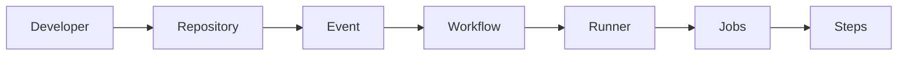

# Chapter 04: GitHub Actions Workflow Events

> **Level:** Beginner to Intermediate
>
> **Prerequisites:** GitHub Actions Fundamentals
>
> **Estimated Reading Time:** 35 Minutes

---

# 📖 Introduction

A workflow without an event will never execute.

Events tell GitHub **when** a workflow should start.

Whenever an event occurs, GitHub checks the repository for matching workflow files and executes them automatically.

Think of an event as a trigger that starts the automation process.

---

# 🎯 Learning Objectives

After completing this chapter, you will understand:

- What are Workflow Events
- Push Event
- Pull Request Event
- Manual Event
- Schedule Event
- Release Event
- Branch Filters
- Path Filters
- Multiple Triggers
- Production Trigger Strategies

---

# Workflow Event Architecture

```mermaid
flowchart LR

Developer

--> Push

Developer

--> Pull Request

Developer

--> Manual

Developer

--> Release

Developer

--> Schedule

Push --> Workflow

Pull Request --> Workflow

Manual --> Workflow

Release --> Workflow

Schedule --> Workflow

Workflow --> Runner
```

---

# What is an Event?

An Event is an activity that occurs inside a GitHub repository.

Examples include:

- Pushing code
- Opening a Pull Request
- Creating a Release
- Clicking "Run Workflow"
- Scheduled execution

Whenever these activities occur, GitHub can automatically start a workflow.

---

# Event Flow



---

# Common Events

| Event | Description |
|--------|-------------|
| push | Trigger when code is pushed |
| pull_request | Trigger on Pull Requests |
| workflow_dispatch | Manual execution |
| schedule | Scheduled execution |
| release | Release published |

---

# Why Events Matter

Imagine an application with:

- 50 Developers
- Hundreds of Commits
- Multiple Releases every week

Running workflows manually every time would be impossible.

Events automate this process.

---

# Real-world Example

Developer pushes code.

↓

GitHub detects Push Event.

↓

Workflow starts.

↓

Runner created.

↓

Application builds automatically.

↓

Tests execute.

↓

Deployment begins.

---

# Event Lifecycle

```mermaid
flowchart TD

Developer

-->

GitHub Repository

-->

Event Generated

-->

Workflow Starts

-->

Runner Created

-->

Jobs Execute

-->

Workflow Completed
```

---

# Benefits

- Complete Automation

- No Manual Work

- Faster Delivery

- Immediate Feedback

- Consistent Deployments

---

# Interview Tip

### Question

What is an Event?

### Expected Answer

An Event is an activity that occurs inside a GitHub repository and triggers a GitHub Actions workflow.

Examples include Push, Pull Request, Manual Execution, Release, and Schedule.

---

# Common Mistakes

❌ Forgetting to define an event

❌ Wrong event syntax

❌ Using incorrect branch filters

❌ Triggering unnecessary workflows

---

# Best Practices

✅ Trigger workflows only when necessary

✅ Filter by branch

✅ Filter by path

✅ Use manual triggers for production deployments

---

# Hands-on Exercise

Create a workflow that:

- Executes only on Push
- Prints

  - Date

  - Hostname

  - Current User

Push code and observe the Actions tab.

---

# Key Takeaways

- Events trigger workflows.
- Without an event, a workflow never starts.
- GitHub supports many event types.
- Events can be filtered for better control.

---

# ➡️ Next (Part 2)

We'll cover:

- Push Event
- Push on Specific Branch
- Branch Filters
- Multiple Branches
- Tag Events
